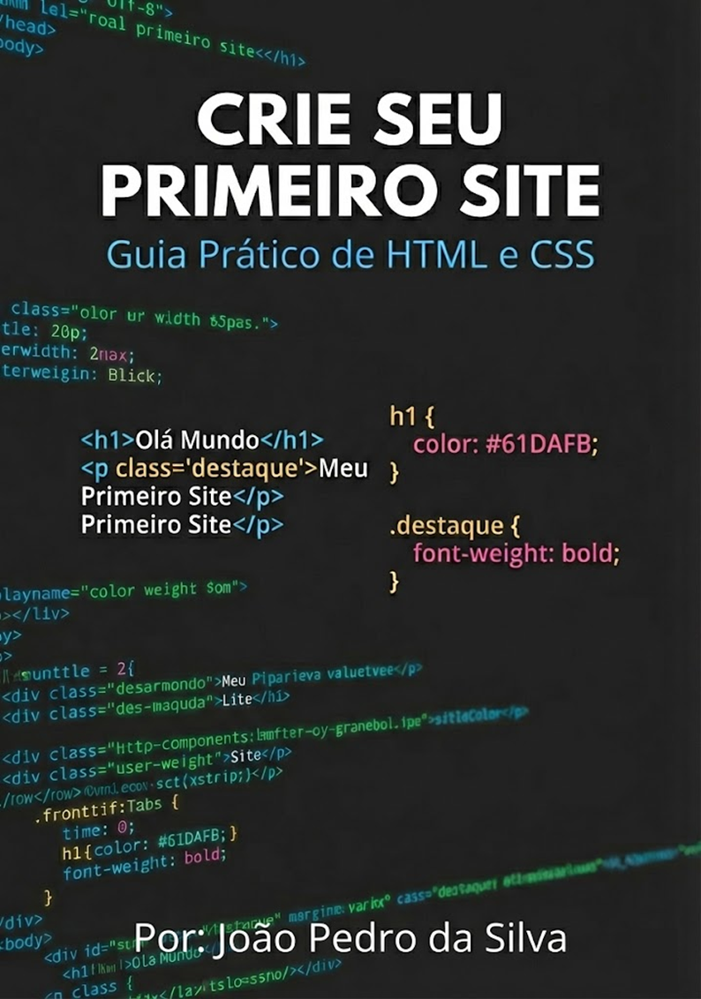

# Crie seu Primeiro Site: Guia Prático de HTML e CSS

## 📖 Sobre o E-book
Bem-vindo ao **Crie seu Primeiro Site**! Este é um e-book completo e gratuito,pensado especialmente para iniciantes absolutos que desejam dar os primeiros passos no desenvolvimento web.

O objetivo deste material é desmistificar a programação usando uma abordagem didática e visual (a "Analogia da Casa"), levando você desde a instalação das ferramentas até a publicação do seu primeiro projeto funcional na internet.

## 🚀 O que você vai aprender?
Este e-book é dividido em 4 capítulos práticos que constroem seu conhecimento de forma lógica:

### Capítulo 1: O Canteiro de Obras (Ferramentas)
* 🛠️ Como a Web funciona de verdade.
* 💻 Configurando seu ambiente com o **VS Code**.
* 🔌 Instalando extensões essenciais como o **Live Server**.

### Capítulo 2: HTML - A Fundação
* 🏗️ A estrutura básica do documento (DOM).
* 🧱 Tags essenciais: Títulos, Parágrafos, Imagens e Links.
* 🏷️ **Semântica Web**: Como escrever códigos que o Google entende.

### Capítulo 3: CSS - Design de Interiores
* 🎨 Dando vida e cor ao site (Sintaxe Básica).
* 📦 Entendendo o **Box Model** (Margens, Bordas e Preenchimentos).
* 💅 Tipografia e Cores Hexadecimais.

### Capítulo 4: Projeto Prático - "Meu Currículo Online"
* 🚀 Construindo um site real do zero.
* 📄 Estruturação do HTML (Dados pessoais, Experiência).
* ✨ Estilização completa com CSS para um visual profissional.

## 🎯 Para quem é este livro?
Este material foi pensado para:
* 🎓 Estudantes de Análise e Desenvolvimento de Sistemas e cursos de TI.
* 🆕 Pessoas em transição de carreira buscando sua primeira habilidade tech.
* 🏢 Empreendedores que desejam entender como seus sites funcionam.
* 🌐 Qualquer pessoa que queira promover sua própria **Inclusão Digital**.

## 📥 Como Baixar
Você pode baixar a versão em PDF mais recente e completa do e-book diretamente na seção **Releases** deste repositório.

## 👤 Sobre o Autor
Este e-book foi criado por **João Pedro da Silva**, estudante de Análise e Desenvolvimento de Sistemas, como parte de um projeto de extensão focado em democratizar o ensino de tecnologia.

## 🐞 Encontrou um Erro?
Este projeto é feito para a comunidade. Se você encontrar qualquer erro de digitação, falha no código ou tiver alguma sugestão de melhoria, por favor, **abra uma Issue** ou envie um Pull Request!
